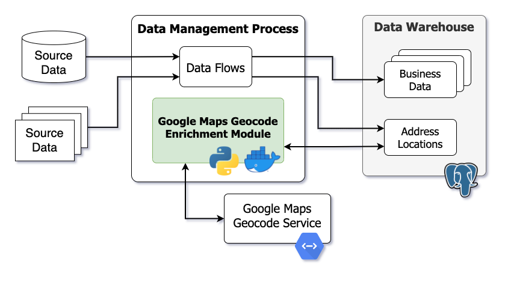

# Google Maps Geocode Enrichment

This project repository provides a headless module to enrich location data in a database table using the Google Maps Geocode API.

## Table of Contents
* [Background](#background)
* [Technical Overview](#technical-overview)
* [Google Web Services Legal Disclaimer](#google-web-services-legal-disclaimer)
* [Project Directory Structure](#project-directory-structure)
* [Prerequisites](#prerequisites)
  * [Technical Prerequisites](#technical-prerequisites)
    * [Google Maps Geocode API Credentials](#google-maps-geocode-api-credentials)
    * [Docker Requirements](#docker-requirements)
    * [Python Requirements](#python-requirements)
    * [PostgreSQL Requirements](#postgresql-requirements)
* [Technical Component Overview](#technical-component-overview)
  * [Dependencies](#dependencies)
  * [Parallelized Enrichment Process](#parallelized-enrichment-process)
  * [Kafka Partitions](#kafka-partitions)
* [Deployment Instructions](#deployment-instructions)
* [Scaling Performance](#scaling-performance)
* [ref_location](#reflocation)
  * [Physical Table Definition](#physical-table-definition)
  * [Logical Data Flow](#logical-data-flow)
* [Common Test Examples](#common-test-examples)
  * [Interactive Geocode API JSON Response from Web Browser](#interactive-geocode-api-json-response-from-web-browser)
* [Required Monitoring and Troubleshooting](#required-monitoring-and-troubleshooting)
  * [Volume Disk Space](#volume-disk-space)
  * [Logs](#logs)
* [Useful Docker Commands](#useful-docker-commands)
* [Standards](#standards)
  * [File Properties](#file-properties)
  * [Coding Standards](#coding-standards)
* [Author Contact](#author-contact)


## Background

This application module was built to provide data cleansing and enrichment for physical mailing address locations scraped from public data sources.  Street address locations can contain many typos, variations in spellings, misspellings and other problems.  The [Google Maps Geocode Service](https://developers.google.com/maps/documentation/geocoding/overview) was selected as a source of data enhancement and enrichment because Google Maps is one of the best sources of location-based addresses across the world and because of the advanced Natural Language Prediction (NLP) capabilities inherent in using this service for address resolution.

The original design of this data enrichment module leveraged the following outputs from the Geocoding API:
1. Latitude / Longitude coorindates for a street address
2. Standardized cleansed street address label
3. Tokenized pieces of the street address for additional filtering, analysis and grouping (i.e. parse "NC" from and address in North Carolina and store in a "State" column)
4. Google Place ID (unique identifier for every location in the world)

The scope of this module is intended to be a headless engine running on an as-needed basis to update records in a database table as a part of a broader data management ETL pipeline.  Example use cases include data warehousing and data lakes.

## Technical Overview

This project repository provides source code to build a process to enrich address locations via the [Google Geocode API](https://developers.google.com/maps/documentation/geocoding/overview).  The source code is in python and is containerized with Docker.  This serves to address 2 main concerns.  First that it is written in a language that is approachable for data analysis purposes, and second it's efficient and fast enough to provide **~500,000 updates in 1 day**.  Parallelization of the Google API interaction step is needed to meet the latter criteria, and containerization serves as a useful means to accomplish that through scaling features of Docker.

The following conceptual diagram highlights where this application fits into a broader data management strategy.
[](./doc/img/overview.png?raw=true)


## Google Web Services Legal Disclaimer

Google provides explicit terms of use for their products.  This application leverages the **Geocoding API** service which has policies to be considered for your intended use of the data retrieved. Sections related to **pre-fetching** and **caching** of content apply directly to this application. Google explicitly states that data from the Geocoding API must not be pre-fetched, cached, or stored except under limited conditions.  

- [Geocoding API Policies](https://developers.google.com/maps/documentation/geocoding/policies)
- [Google Maps Platform Terms of Service](https://cloud.google.com/maps-platform/terms)
- [Google Maps Platform Service Specific Terms](https://cloud.google.com/maps-platform/terms/maps-service-terms)

The author of this project repository and application makes no legal recommendations or interpretations on how to adhere to Google Geocoding API policies for applications developed commercially or contained within your on-premise environment. Use at your own discretion.


## Project Directory Structure

Key components are organized into the following directory structure:
- [/cluster](./cluster) - Production code is contained in **cluster**.  It reuses the library code used by the experimental code, but is organized as standalone apps (assumed running each within a docker) that communicate via **Kafka**. Contains docker files, python app.py files, docker compose yml files - the main code and components for establishing and running the kafka infrasturcutre and apps to establish many clients to ping the Google Maps API using the bulk key and return results to the PostgreSQL database.
  - [../infra](./cluster/infra) - **docker-compose.yml** specifies serivces for kafka queueing (zookeeper and kafka services) and includes environment variables and connection properties for services (ports, kafka topics, docker network, etc).
  - [../app](./cluster/app)
    - **docker-compose.yml**
    - [.../g_query](./cluster/app/g_query) - Contains docker file and app.py file that contains the Google Maps API Key and functions to look up each location and bring back results.
    - [.../pg_query](./cluster/app/pg_query) - Contains docker file and app.py file that contains the DB credentials to connect to the DB using a SQL statement specifying to pull records with a null enrichment status or records that have not been looked up within the past 30 days.
    - [.../pg_update](./cluster/app/pg_update) - Contains docker file and app.py file that is responsible for updating the DB with the additional enhanced address information.
- [/doc](./doc) - Project documentation. Example DDL provided for creating the ref_location database table used to cache geocode results by location.
- [/lib](./lib) - Library code is contained in **lib**.  It constitutes the core reusable components for obtaining work from postgres, querying and collecting results from Google, and updating postgres.  Both the experimental code as well the the production cluster code makes use of it in the same way.
- [/test](./test) - Experiments, testing and debugging code.  Different aspects of the dev process are illustrated here and can serve as simplistic checks for additional features.
  - [../postgres_db](./test/postgres_db) - Containerized version of PostgreSQL for development and testing purposes only.


## Prerequisites

Use of this application requires working knowledge of the following technologies:

- [Docker](https://www.docker.com/) and [Docker Compose](https://docs.docker.com/compose/)
- [Python](https://www.python.org/)
- [Google Cloud Platform](https://cloud.google.com/)
- [Google Maps Geocoding API](https://developers.google.com/maps/documentation/geocoding/overview)

### Technical Prerequisites

- Command Line Interface
  - Mac and Linux machines natively support
  - Windows machines will need a [linux subsystem](https://docs.microsoft.com/en-us/windows/wsl/install)
- [PostgreSQL Database](https://www.postgresql.org/) (any version)


#### Google Maps Geocode API Credentials

This application requires an API key to query the [Google Maps Geocode API](https://console.cloud.google.com/apis/library/geocoding-backend.googleapis.com).  You must have the Geocoding API enabled from within the Google Cloud console as well as a functioning API key.

- [Geocoding API](https://console.cloud.google.com/apis/library/geocoding-backend.googleapis.com)

The API key is stored in the [docker-compose.yml](./cluster/app/docker-compose.yml) file which builds and runs the docker application as described in [Step 5 of the Deployment Instructions](#deployment-instructions).


#### Docker Requirements

This application requires the latest version of Docker installed and running.

- [Get Docker](https://docs.docker.com/get-docker/)

This application leverages a Docker network to containerize network activity. **docker-compose.yml** files within [/cluster](./cluster) reference the **geocode** network.

```bash
docker network create geocode
```


#### Python Requirements

This application requires the latest version of Python installed.

- [Download Python](https://www.python.org/downloads/)


#### PostgreSQL Requirements

This application was built using PostgreSQL version 11.x and currently only supports PostgreSQL.  Any version of PostgreSQL should work.  This application uses standard SQL table generation, reads and updates. **Define the [schema search path](https://www.postgresql.org/docs/9.3/ddl-schemas.html) for the PostgreSQL database user to prevent communication problems.** Schema-specific references are not defined within this project repository.

- [Download PostgreSQL](https://www.postgresql.org/download/)

A [containerized version of PostgreSQL](./test/postgres_db) is provided to help understand the application in your local environment. Step 2 of the [Deployment Instructions](#deployment-instructions) provides further information on deploying the sample PostgreSQL docker container.

##### PostgreSQL Database Connection

By default this application uses a [containerized version of PostgreSQL](./test/postgres_db) deployed locally to provide an easy interface for development and testing.  Database credentials are stored in the [docker-compose.yml](./cluster/app/docker-compose.yml) file located within `/cluster/app`.

- `POSTGRES_HOST` - Hostname of target PostgreSQL database server
- `POSTGRES_DB` - Database name of target PostgreSQL database
- `POSTGRES_USER` - PostgreSQL user (i.e. service account)
- `POSTGRES_PASSWORD` - PostgreSQL user password to authenticate

Further context on database credentials can be found in [Step 5 of the Deployment Instructions](#deployment-instructions).


##### Define PostgreSQL User Search Schema Path

The following command defines the default search path for a given PostgreSQL database user. The following command must be executed within the database.

```
SET search_path TO <your schema>;
```

Further information can be found in the [PostgreSQL Schema documentation](https://www.postgresql.org/docs/9.3/ddl-schemas.html).


## Technical Component Overview

The following list provides an overview of key components:
- PostgreSQL database
- [ref_location](#reflocation) table within PostgreSQL database to store location data
- **geocode_lib** library (custom python application written in Docker)
- [Kafka Infrastructure](#kafka-partitions)
- Enrichment process (custom python applications built with docker compose)


### Dependencies

PostgreSQL and Kafka must be running before the enrichment process begins.  The `geocode_lib` Docker image must be built as well.  The enrichment process leverages these in a service-oriented manner.


### Parallelized Enrichment Process

Queries to Google must be parallelized; to accomplish this, a single client (**pg_query**) interacts with postgres, places the query on a kafka topic **geocode_input**, multiple clients (**g_query**) take these queries in parallel and convert the result to a format usable by the to-progres process and place it in a result topic **geocode_output**. And finally a single process (**pg_update**) reads the contents of that output topic and updates the database with the results.

The rate limiting is controlled by **pg_query**.

#### Scaling Performance

The enrichment process can be scaled in parallel using the `g_query` parameter described in Step 5 of the [Deployment Instructions](#deployment-instructions).  Suggested values are provided below.
- Development Unit Testing = 2
- QA Testing = 10-50
- Production = 90-110

Ensure Kafka partitions are defined appropriately as described in the [Kafka Partitions](#kafka-partitions) section.  This application was originally built and operational on a small machine with only **4 vCPUs running 110 parallel threads** (`g_query`=110).


### Kafka Partitions

To allow the parallelism concept to work, the geocode_input Kafka topic must have a number of partitions greater or equal to the number of g_query clients.

Enter the running Kafka Docker container.
```bash
docker exec -it infra_kafka_1 /bin/bash
```

Set partitions on a new topic
```bash
kafka-topics.sh --create --zookeeper zookeeper --topic geocode_input --partitions 50 --replication-factor 1
```

Or if the topic already exists
```bash
kafka-topics.sh --alter --zookeeper zookeeper --topic geocode_input --partitions 50
```

Additional documentation can be found on the [wurstmeister Kafka Github](https://github.com/wurstmeister/kafka-docker).


## Deployment Instructions

The following steps can be used to build a local environment for development and testing purposes or a production environment for data enrichment as a part of an ETL data flow process.

1. **Define Docker Network**

  ```bash
  docker network create geocode
  ```

  If the network already exists, Docker will display a message.

2. **Build and Start PostgreSQL Database Container (if desired) for development and testing purposes only.** Production data management flows will most likely have other PostgreSQL database sources which can be configured within the [docker-compose.yml](./cluster/app/docker-compose.yml) file.  Further instructions provide steps to configure this file.

  Switch to Docker image definition from the project root.
  ```bash
  cd test/postgres_db
  ```

  Build PostgreSQL Docker image using the Dockerfile.
  ```bash
  docker build -t postgres .
  ```
  - The [Dockerfile](./test/postgres_db/Dockerfile) defines steps used to deploy the latest version of PostgreSQL for development and testing purposes.
  - The **init.sql** file is copied into the Docker image and executed when the container is started, which creates the required **ref_location** database table used to cache location enrichment data.
  - The **seed.sh** script is copied into the Docker image and executed when the container is started, which seeds sample data from the [ref_location_sample.csv](./test/postgres_db/ref_location_sample.csv) file.
  - Sample location data is copied into the Docker image and deployed when the container starts using CSV files within [/test/postgres_db](./test/postgres_db). The [ref_location_sample.csv](./test/postgres_db/ref_location_sample.csv) file is used by default.

  Start the PostgreSQL Container from the image named `postgres` created previously. The `--network` parameter `geocode` references the Docker network created previously. The `-p` parameter maps the default PostgreSQL port of `5432` from the Docker network to your local network. Create your own password using the `POSTGRES_PASSWORD` parameter.
  ```bash
  docker run --name postgres --network geocode -p 5432:5432/tcp -e POSTGRES_PASSWORD=YOUR_PASSWORD -d postgres
  ```

  Connect to the PostgreSQL database using a tool such as [pgAdmin](https://www.pgadmin.org/) to test the database connectivity and explore the sample data contained within the **ref_location** table.  The sample database created in this process is the latest version of PostgreSQL with a database called `postgres`, a user named `postgres` and a password set when running the Docker container.

3. **Build Geocode Library Docker Image**

  Switch to Docker image definition from the project root.
  ```bash
  cd lib
  ```

  Build `geocode_lib` Docker image using the Dockerfile.
  ```bash
  docker build -t geocode_lib .
  ```
  - The [Dockerfile](./lib/geocode_lib/Dockerfile) defines how the Python application is built.

  The `geocode_lib` Docker image is built using [python code](./lib/geocode_lib) to help translate data between the Geocode API and the PostgreSQL target database.

4. **Build and Deploy Kafka Infrastructure**

  Switch to Docker image definition from the project root.
  ```bash
  cd cluster/infra
  ```

  Build and start the Kafka infrastructure using docker-compose.
  ```bash
  docker-compose up -d
  ```
  - The [docker-compose.yml](./cluster/infra/docker-compose.yml) defines how Kafka is deployed.
  - Official images are built from the [wurstmeister](https://hub.docker.com/r/wurstmeister/kafka) Docker hub.

  The `docker-compose` command above builds and runs the Docker container in the background.

5. **Build Apps** for retrieving locations to enrich, querying the geoode API and updating location data in target database.

  Switch to Docker image definition from the project root.
  ```bash
  cd cluster/app
  ```

  Build and start the application using docker-compose.
  ```bash
  docker-compose up -d --scale g_query=5
  ```
  - The [docker-compose.yml](./cluster/app/docker-compose.yml) defines the application engine as well as critical credentials for the Google Geocode API and target PostgreSQL database. Update the `API_KEY` to your Google Geocode API key.  Update values for `POSTGRES_HOST`, `POSTGRES_DB`, `POSTGRES_USER`, and `POSTGRES_PASSWORD` to define your database connection to PostgreSQL. By default, the `POSTGRES_HOST` variable points to the sample PostgreSQL database image within the Docker network created previously.  The `POSTGRES_HOST` variable name must point to a hostname that the Docker network can resolve.

  The `docker-compose` command above builds and runs the Docker container in the background.


## ref_location Table

The **ref_location** table is used to store location information and results from this enrichment application process retrieved from the Google Maps Geocode API.  This section describes the physical structure of the table as well as intended usage and data flow expectations.  DDL code is provided to build this table along with useful indexes and constraints for PostgreSQL in [./doc/ref_location_ddl.sql](./doc/ref_location_ddl.sql). This application was built using PostgreSQL and currently only supports PostgreSQL.

### Physical Table Definition

The following table describes each column in the **ref_location** table.  Data types align with PostgreSQL supported data types.  Data flow describes where the record value originates for each column.  Record values loaded into **ref_location** via standard ETL data flows are marked with the acronym **ETL**.  These are typically required fields used by this application module to query the Google Maps Geocode API service or for internal record management purposes.  Record values updated by this enrichment application module are marked with the term **App** or **Geocode API (App)**.  Columns marked with **Geocode API (App)** are populated from Google Maps, through the Geocode API, managed by this application.

| Column Name | Data Type | Description | Required? | Data Flow |
| :-- | :--: | :----- | :--: | :--- |
| location_hash | text | Unique hash or natural key of address location. **Primary key constraint**.  | Yes | ETL |
| location | text | Raw address location either as an atomic-level street address or simple city / state.  | Yes | ETL |
| enrichment_enabled | boolean | True/false value indicating if location enrichment using this application is enabled for record. | Yes | ETL |
| enrichment_status | text | Simple description of the enrichment process status (`IN_PROCESS`, `COMPLETE`, or null) | | App |
| formatted_address | text | Standardized and cleansed address | | Geocode API (App) |
| latitude | numeric(11,6) | Latitude coordinate of location. | | Geocode API (App) |
| longitude | numeric(11,6) | Longitude coordinate of location. | | Geocode API (App) |
| load_dttm | timestamp | When the record was loaded into this table. | | App |
| last_update_dttm | timestamp | When the record was last updated. | | App |
| google_place_id | text | Unique place identifier provided by Google Maps. | | Geocode API (App) |
| google_partial_match | boolean | Indicates if the raw location returns a partial match from the Google Maps Geocode API. | | Geocode API (App) |
| google_result_count | integer | Number of addresses resolved by the Google Maps Geocode API. | | Geocode API (App) |
| google_result_type | jsonb | JSON string listing of the possible [address types](https://developers.google.com/maps/documentation/geocoding/overview#Types). | | Geocode API (App) |
| long_street_number | text | Full text description. See [address types and components](https://developers.google.com/maps/documentation/geocoding/overview#Types). | | Geocode API (App) |
| long_route | text | Full text description. See [address types and components](https://developers.google.com/maps/documentation/geocoding/overview#Types). | | Geocode API (App) |
| long_political | text | Full text description. See [address types and components](https://developers.google.com/maps/documentation/geocoding/overview#Types). | | Geocode API (App) |
| long_locality | text | Full text description. See [address types and components](https://developers.google.com/maps/documentation/geocoding/overview#Types). | | Geocode API (App) |
| long_postal_code | text | Full text description. See [address types and components](https://developers.google.com/maps/documentation/geocoding/overview#Types). | | Geocode API (App) |
| long_postal_code_suffix | text | Full text description. See [address types and components](https://developers.google.com/maps/documentation/geocoding/overview#Types). | | Geocode API (App) |
| long_postal_town | text | Full text description. See [address types and components](https://developers.google.com/maps/documentation/geocoding/overview#Types). | | Geocode API (App) |
| long_premise | text | Full text description. See [address types and components](https://developers.google.com/maps/documentation/geocoding/overview#Types). | | Geocode API (App) |
| long_country | text | Full text description. See [address types and components](https://developers.google.com/maps/documentation/geocoding/overview#Types). | | Geocode API (App) |
| long_admin_area_level_1 | text | Full text description. See [address types and components](https://developers.google.com/maps/documentation/geocoding/overview#Types). | | Geocode API (App) |
| long_admin_area_level_2 | text | Full text description. See [address types and components](https://developers.google.com/maps/documentation/geocoding/overview#Types). | | Geocode API (App) |
| long_admin_area_level_3 | text | Full text description. See [address types and components](https://developers.google.com/maps/documentation/geocoding/overview#Types). | | Geocode API (App) |
| long_admin_area_level_4 | text | Full text description. See [address types and components](https://developers.google.com/maps/documentation/geocoding/overview#Types). | | Geocode API (App) |
| long_admin_area_level_5 | text | Full text description. See [address types and components](https://developers.google.com/maps/documentation/geocoding/overview#Types). | | Geocode API (App) |
| long_establishment | text | Full text description. See [address types and components](https://developers.google.com/maps/documentation/geocoding/overview#Types). | | Geocode API (App) |
| short_street_number | text | Abbreviated description. See [address types and components](https://developers.google.com/maps/documentation/geocoding/overview#Types). | | Geocode API (App) |
| short_route | text | Abbreviated description. See [address types and components](https://developers.google.com/maps/documentation/geocoding/overview#Types). | | Geocode API (App) |
| short_political | text | Abbreviated description. See [address types and components](https://developers.google.com/maps/documentation/geocoding/overview#Types). | | Geocode API (App) |
| short_locality | text | Abbreviated description. See [address types and components](https://developers.google.com/maps/documentation/geocoding/overview#Types). | | Geocode API (App) |
| short_postal_code | text | Abbreviated description. See [address types and components](https://developers.google.com/maps/documentation/geocoding/overview#Types). | | Geocode API (App) |
| short_postal_code_suffix | text | Abbreviated description. See [address types and components](https://developers.google.com/maps/documentation/geocoding/overview#Types). | | Geocode API (App) |
| short_postal_town | text | Abbreviated description. See [address types and components](https://developers.google.com/maps/documentation/geocoding/overview#Types). | | Geocode API (App) |
| short_premise | text | Abbreviated description. See [address types and components](https://developers.google.com/maps/documentation/geocoding/overview#Types). | | Geocode API (App) |
| short_country | text | Abbreviated description. See [address types and components](https://developers.google.com/maps/documentation/geocoding/overview#Types). | | Geocode API (App) |
| short_admin_area_level_1 | text | Abbreviated description. See [address types and components](https://developers.google.com/maps/documentation/geocoding/overview#Types). | | Geocode API (App) |
| short_admin_area_level_2 | text | Abbreviated description. See [address types and components](https://developers.google.com/maps/documentation/geocoding/overview#Types). | | Geocode API (App) |
| short_admin_area_level_3 | text | Abbreviated description. See [address types and components](https://developers.google.com/maps/documentation/geocoding/overview#Types). | | Geocode API (App) |
| short_admin_area_level_4 | text | Abbreviated description. See [address types and components](https://developers.google.com/maps/documentation/geocoding/overview#Types). | | Geocode API (App) |
| short_admin_area_level_5 | text | Abbreviated description. See [address types and components](https://developers.google.com/maps/documentation/geocoding/overview#Types). | | Geocode API (App) |
| short_establishment | text | Abbreviated description. See [address types and components](https://developers.google.com/maps/documentation/geocoding/overview#Types). | | Geocode API (App) |
| location_type | jsonb | Address type. See [address types and components](https://developers.google.com/maps/documentation/geocoding/overview#Types). | | Geocode API (App) |
| enrichment_api_response | jsonb | Full API JSON response provided by Geocode API service. | | Geocode API (App) |

Additional documentation on geocode data output can be found on the [Google Maps Platform Documentation](https://developers.google.com/maps/documentation/geocoding/overview).


### Logical Data Flow

The **ref_location** table is designed to be an independent source and target to write any type of address location typically entered into Google Maps or any street address location service or GIS tool.  Addresses may be partial, limited or only cover broad cities or states.  The Google Maps Geocode API will provide a value regardless and this application enrichment process will ingest and update the **ref_location** table accordingly.  PostgreSQL is a high performance transactional database which can manage many simultaneous reads, writes and updates. The `location_hash` value must be pre-computed prior to inserting into the **ref_location** table.  This can be something simple such as an MD5 hash of the location string.  Assuming this enrichment process is running, as location records are inserted into **ref_location** they will be updated in near real time or as the queue permits.


## Common Test Examples

### Interactive Geocode API JSON Response from Web Browser

To simulate the Geocode API interactively from a web browser and visually understand the JSON response, use the following URL structure with your API key:

`https://maps.googleapis.com/maps/api/geocode/json?address=1030%20Richardson%20Dr,%20Raleigh,%20NC%2027603&key=ENTER_YOUR_API_KEY`


## Required Monitoring and Troubleshooting

### Volume Disk Space

As the application threads into many parallel queries disk storage can become over leveraged.  Monitor disk utilization using the `df -h` command from the Docker host machine.  If disk storage becomes a problem, there could be orphaned disk volumes. Stop all services using the `docker-compose down` command and use the following command to clear dangling docker volumes.

```bash
docker volume rm $(docker volume ls -qf dangling=true)
```

### Logs

Monitor Docker logs using the following commands.

List docker containers.
```bash
docker container ls
```

View logs from a container with an exit status.
```bash
docker logs <name of container that exited >
```

## Useful Docker Commands

List docker networks: `docker network ls`

Display useful information about a docker network: `docker network inspect <network name>`

List all docker images: `docker image ls`

List all active and running containers: `docker ps`

List all active (and inactive) containers: `docker ps -a`
- Helpful to see if one of the apps exited. If that happens, need to restart process, search logs, and possibly decrease number of scaled g_query apps.

Print docker log for troubleshooting: `docker logs app_pg_update_1`
- Or whatever log you want to look at, after running docker ps –a

Remove images individually: `docker rmi <image ID>`
- Useful when modifying something within the process and need to rebuild the images and containers


## Standards

### File Properties

 - filenames must be lowercase using underscores
 - unix style line endings (LF)
 - UTF-8 encoding

### Coding Standards

 - Indentation = 2 spaces with no tabs.
 - Empty lines separating major steps.
 - The phrase **NOTE:** is used to highlight important notes throughout code.
 - The phrase **TODO:** is used to note future enhancements.
 - Environment variables are named with all capital letters and underscores
 - Python variables are named in camel case


## Author Contact

 - [Steve Overton](https://www.linkedin.com/in/overton/)
